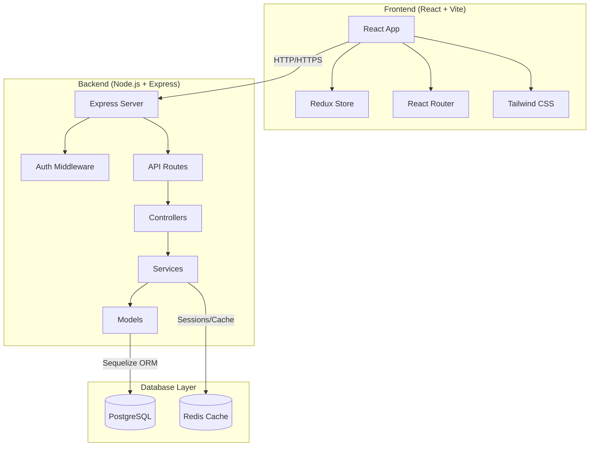

# ☕ Sistema de Gestión de Cafetería L'Bandito

[](https://choosealicense.com/licenses/mit/)
[](https://nodejs.org/)
[](https://reactjs.org/)
[](https://postgresql.org/)
[](https://docker.com/)

Un sistema completo de gestión para cafeterías desarrollado con tecnologías modernas. Incluye gestión de productos, usuarios, inventario, sistema de pedidos y un panel de administración intuitivo con diferentes roles de usuario.

## 📖 Tabla de Contenidos

- [Características](#-características)
- [Demo](#-demo)
- [Instalación](#-instalación)
- [Uso](#-uso)
- [Tecnologías](#️-tecnologías)
- [Arquitectura](#-arquitectura)
- [API Reference](#-api-reference)
- [Configuración](#-configuración)
- [Despliegue](#-despliegue)
- [Testing](#-testing)
- [Contribuir](#-contribuir)
- [Roadmap](#-roadmap)
- [Licencia](#-licencia)
- [Soporte](#-soporte)

## ✨ Características

### 🔐 **Sistema de Autenticación Completo**
- ✅ Login/registro con validación robusta
- ✅ JWT tokens con renovación automática
- ✅ Sistema de roles: **Admin**, **Vendedor**, **Cliente**
- ✅ Protección de rutas y middlewares de autorización
- ✅ Sesiones persistentes con localStorage

### 👥 **Gestión Avanzada de Usuarios**
- ✅ Perfiles de usuario completos con foto
- ✅ Gestión de direcciones múltiples
- ✅ Dashboard personalizado por rol
- ✅ Historial de actividades
- ✅ Sistema de configuraciones por usuario

### 🛍️ **Catálogo de Productos Profesional**
- ✅ CRUD completo con validaciones
- ✅ Gestión de categorías e inventario
- ✅ Subida de imágenes optimizada
- ✅ Filtros avanzados y búsqueda en tiempo real
- ✅ Sistema de precios y descuentos

### 🛒 **Sistema de Carrito y Pedidos**
- ✅ Carrito persistente entre sesiones
- ✅ Gestión completa de pedidos
- ✅ Estados de pedido trackeable
- ✅ Integración con métodos de pago
- ✅ Notificaciones en tiempo real

### 📊 **Panel de Administración Avanzado**
- ✅ Dashboard con métricas en tiempo real
- ✅ Gráficos interactivos con Recharts
- ✅ Gestión de ventas y estadísticas
- ✅ Sistema de reportes exportables
- ✅ Gestión de mesas (para POS)

### 🎨 **UI/UX Moderna**
- ✅ Diseño responsive (mobile-first)
- ✅ Tema dark/light (preparado)
- ✅ Componentes reutilizables con Tailwind CSS
- ✅ Animaciones y micro-interacciones
- ✅ Accesibilidad (ARIA labels, keyboard navigation)

## 🌐 Demo

### Enlaces de Demostración
- **Frontend**: [https://cafeteria-demo.vercel.app](placeholder)
- **Backend API**: [https://api-cafeteria-demo.herokuapp.com](placeholder)
- **Documentación API**: [https://api-cafeteria-demo.herokuapp.com/api-docs](placeholder)

### Credenciales de Prueba
```
Admin:
📧 admin@cafeteria.com
🔑 admin123

Vendedor:
📧 vendedor@cafeteria.com  
🔑 vendedor123

Cliente:
📧 cliente@cafeteria.com
🔑 cliente123
```

## 🚀 Instalación

### 📋 Prerrequisitos

Asegúrate de tener instalado lo siguiente:

```bash
Node.js >= 18.0.0
PostgreSQL >= 14.0
npm >= 8.0.0 (o yarn >= 1.22.0)
Git
```

### ⚡ Instalación Rápida con Docker (Recomendada)

```bash
# 1. Clonar el repositorio
git clone https://github.com/tu-usuario/cafeteria-l-bandito.git
cd cafeteria-l-bandito

# 2. Configurar variables de entorno
cp backend/env.example backend/.env
cp frontend/.env.example frontend/.env

# 3. Levantar todo el stack
docker-compose up -d

# 4. Ejecutar migraciones
docker-compose exec backend npm run migrate

# 5. Insertar datos de prueba (opcional)
docker-compose exec backend npm run seed
```

✅ **¡Listo!** La aplicación estará disponible en:
- Frontend: http://localhost:80
- Backend: http://localhost:3000
- Base de datos: localhost:5432

### 🛠️ Instalación Manual

<details>
<summary>Click para expandir instalación manual</summary>

#### 1. Configurar Base de Datos
```bash
# Crear base de datos
createdb cafeteria_l_bandito

# Ejecutar script de estructura
psql -d cafeteria_l_bandito -f backend/database_setup.sql
```

#### 2. Configurar Backend
```bash
cd backend

# Instalar dependencias
npm install

# Configurar variables de entorno
cp env.example .env
# Editar .env con tus credenciales

# Ejecutar migraciones
npm run migrate

# Insertar datos de prueba
npm run seed

# Iniciar servidor de desarrollo
npm run dev
```

#### 3. Configurar Frontend
```bash
cd frontend

# Instalar dependencias
npm install

# Configurar variables de entorno
cp .env.example .env
# Editar .env con la URL del backend

# Iniciar servidor de desarrollo
npm run dev
```

</details>

## 🎯 Uso

### Flujo de Usuario

1. **Registro/Login**: Los usuarios pueden registrarse o iniciar sesión
2. **Explorar Productos**: Navegar por el catálogo con filtros
3. **Agregar al Carrito**: Seleccionar productos y cantidades
4. **Realizar Pedido**: Checkout con información de entrega
5. **Tracking**: Seguimiento del estado del pedido

### Flujo de Admin

1. **Dashboard**: Vista general de métricas y ventas
2. **Gestión de Productos**: CRUD completo de productos y categorías
3. **Gestión de Usuarios**: Administrar vendedores y clientes
4. **Pedidos**: Gestionar estados y procesar órdenes
5. **Reportes**: Generar reportes de ventas y estadísticas

### Flujo de Vendedor

1. **Dashboard Personal**: Métricas de sus ventas
2. **Gestión de Productos**: Administrar su inventario
3. **POS (Point of Sale)**: Sistema de venta directa
4. **Pedidos**: Gestionar sus órdenes asignadas

## 🛠️ Tecnologías

### Backend
| Tecnología | Versión | Propósito |
|------------|---------|-----------|
| **Node.js** | 18+ | Runtime de JavaScript |
| **Express.js** | 4.18+ | Framework web |
| **PostgreSQL** | 14+ | Base de datos principal |
| **Sequelize** | 6.31+ | ORM para PostgreSQL |
| **Redis** | 7+ | Cache y sesiones |
| **JWT** | 9+ | Autenticación |
| **Bcrypt** | 5+ | Hash de contraseñas |
| **Swagger** | 4+ | Documentación API |
| **Winston** | 3+ | Logging |
| **Helmet** | 6+ | Seguridad HTTP |
| **Rate Limiter** | 6+ | Protección DDoS |

### Frontend  
| Tecnología | Versión | Propósito |
|------------|---------|-----------|
| **React** | 18+ | Biblioteca UI |
| **Vite** | 5+ | Build tool |
| **Redux Toolkit** | 2+ | State management |
| **React Router** | 6+ | Enrutamiento |
| **Tailwind CSS** | 3+ | Framework CSS |
| **Headless UI** | 2+ | Componentes accesibles |
| **Recharts** | 2+ | Gráficos |
| **React Hook Form** | 7+ | Manejo de formularios |
| **Axios** | 1+ | Cliente HTTP |
| **SweetAlert2** | 11+ | Modales y alertas |

### DevOps & Tools
| Tecnología | Propósito |
|------------|-----------|
| **Docker** | Containerización |
| **Docker Compose** | Orquestación |
| **Nginx** | Reverse proxy |
| **ESLint** | Linting JavaScript |
| **Prettier** | Formateo de código |
| **Husky** | Git hooks |
| **Jest** | Testing |
| **GitHub Actions** | CI/CD |

## 🏗️ Arquitectura

### Diagrama de Arquitectura



### Estructura de Carpetas

```
proyecto_final_cafeteria/
├── 📁 backend/                 # API Server (Node.js)
│   ├── 📁 src/
│   │   ├── 📁 controllers/     # Controladores de rutas
│   │   ├── 📁 services/        # Lógica de negocio
│   │   ├── 📁 models/          # Modelos de datos (Sequelize)
│   │   ├── 📁 routes/          # Definición de rutas
│   │   ├── 📁 middlewares/     # Middlewares personalizados
│   │   ├── 📁 config/          # Configuraciones
│   │   ├── 📁 utils/           # Utilidades
│   │   └── 📁 scripts/         # Scripts de mantenimiento
│   ├── 📄 database_setup.sql   # Schema de BD
│   ├── 📄 Dockerfile          # Container del backend
│   └── 📄 package.json        # Dependencias
├── 📁 frontend/                # Cliente Web (React)
│   ├── 📁 src/
│   │   ├── 📁 components/      # Componentes reutilizables
│   │   │   ├── 📁 ui/          # Componentes base
│   │   │   ├── 📁 features/    # Componentes de características
│   │   │   ├── 📁 layout/      # Layouts
│   │   │   └── 📁 forms/       # Formularios
│   │   ├── 📁 pages/           # Páginas principales
│   │   ├── 📁 services/        # Servicios de API
│   │   ├── 📁 store/           # Redux store y slices
│   │   ├── 📁 hooks/           # Custom hooks
│   │   ├── 📁 utils/           # Utilidades
│   │   ├── 📁 constants/       # Constantes
│   │   └── 📁 assets/          # Recursos estáticos
│   ├── 📄 Dockerfile          # Container del frontend
│   └── 📄 package.json        # Dependencias
├── 📁 docs/                    # Documentación adicional
├── 📄 docker-compose.yml       # Orquestación completa
├── 📄 docker-compose.prod.yml  # Configuración de producción
└── 📄 README.md               # Este archivo
```

### Patrones de Diseño Implementados

- **MVC (Model-View-Controller)**: Separación clara de responsabilidades
- **Repository Pattern**: Abstracción de acceso a datos
- **Service Layer**: Lógica de negocio centralizada  
- **Middleware Pattern**: Interceptores para auth, logging, etc.
- **Component-Based Architecture**: Componentes reutilizables en React
- **Redux Pattern**: Estado global predecible

## 📚 API Reference

### Base URL
```
Desarrollo: http://localhost:3000/api
Producción: https://api-cafeteria.dominio.com/api
```

### Autenticación

Todas las rutas protegidas requieren el header:
```http
Authorization: Bearer <JWT_TOKEN>
```

### Endpoints Principales

<details>
<summary>🔐 Autenticación</summary>

```http
POST /api/usuarios/login
Content-Type: application/json

{
  "email": "usuario@ejemplo.com",
  "password": "contraseña123"
}
```

**Respuesta:**
```json
{
  "success": true,
  "data": {
    "token": "eyJhbGciOiJIUzI1NiIs...",
    "user": {
      "id": 1,
      "email": "usuario@ejemplo.com",
      "nombre": "Juan",
      "rol": "cliente"
    }
  }
}
```

</details>

<details>
<summary>🛍️ Productos</summary>

```http
GET /api/productos?categoria=bebidas&limite=10&pagina=1
```

**Respuesta:**
```json
{
  "success": true,
  "data": {
    "productos": [...],
    "total": 50,
    "pagina": 1,
    "totalPaginas": 5
  }
}
```

</details>

<details>
<summary>🛒 Carrito</summary>

```http
POST /api/carritos/agregar
Authorization: Bearer <token>
Content-Type: application/json

{
  "producto_id": 1,
  "cantidad": 2
}
```

</details>

### Documentación Completa

La documentación completa de la API está disponible en:
- **Swagger UI**: http://localhost:3000/api-docs
- **Redoc**: http://localhost:3000/redoc

## ⚙️ Configuración

### Variables de Entorno

#### Backend (.env)
```env
# Base de datos
DB_HOST=localhost
DB_PORT=5432
DB_NAME=cafeteria_l_bandito
DB_USER=postgres
DB_PASS=tu_password

# Servidor
PORT=3000
NODE_ENV=development

# Seguridad
JWT_SECRET=tu_jwt_secret_muy_seguro_de_64_caracteres_minimo
CORS_ORIGIN=http://localhost:5173

# Redis (opcional)
REDIS_HOST=localhost
REDIS_PORT=6379
REDIS_PASSWORD=

# Email (futuro)
EMAIL_HOST=smtp.gmail.com
EMAIL_PORT=587
EMAIL_USER=
EMAIL_PASS=

# Archivos
UPLOAD_PATH=./uploads
MAX_FILE_SIZE=5242880
```

#### Frontend (.env)
```env
# API Configuration
VITE_API_BASE_URL=http://localhost:3000/api
VITE_APP_NAME=Cafetería L'Bandito
VITE_APP_VERSION=1.0.0

# Features
VITE_ENABLE_ANALYTICS=false
VITE_ENABLE_PWA=false

# Environment
VITE_NODE_ENV=development
```

### Configuración de Desarrollo

#### VSCode Extensions Recomendadas
```json
{
  "recommendations": [
    "esbenp.prettier-vscode",
    "dbaeumer.vscode-eslint",
    "ms-vscode.vscode-typescript-next",
    "bradlc.vscode-tailwindcss",
    "ms-vscode.vscode-json"
  ]
}
```

#### Scripts Útiles
```bash
# Desarrollo
npm run dev          # Iniciar servidor de desarrollo
npm run dev:watch    # Con recarga automática

# Testing
npm run test         # Ejecutar tests
npm run test:watch   # Tests en modo watch
npm run test:coverage # Coverage report

# Linting y Formateo
npm run lint         # ESLint
npm run lint:fix     # Auto-fix de ESLint
npm run format       # Prettier

# Base de datos
npm run migrate      # Ejecutar migraciones
npm run seed         # Insertar datos de prueba
npm run db:reset     # Reset completo de BD
```

## 🚀 Despliegue

### Desarrollo Local
```bash
# Opción 1: Docker Compose (recomendada)
docker-compose up -d

# Opción 2: Manual
npm run dev:all
```

### Staging
```bash
# Usar configuración de staging
docker-compose -f docker-compose.staging.yml up -d
```

### Producción

#### Con Docker (Recomendado)
```bash
# 1. Configurar variables de producción
cp backend/env.production backend/.env
cp frontend/.env.production frontend/.env

# 2. Build y deploy
docker-compose -f docker-compose.prod.yml up -d --build

# 3. Ejecutar migraciones
docker-compose -f docker-compose.prod.yml exec backend npm run migrate
```

#### Manual
```bash
# Backend
cd backend
npm ci --only=production
npm run build
pm2 start ecosystem.config.js

# Frontend  
cd frontend
npm ci
npm run build
# Servir con nginx
```

#### Nginx Configuration
```nginx
server {
    listen 80;
    server_name tu-dominio.com;
    
    # Frontend
    location / {
        root /var/www/html;
        try_files $uri $uri/ /index.html;
    }
    
    # Backend API
    location /api {
        proxy_pass http://localhost:3000;
        proxy_set_header Host $host;
        proxy_set_header X-Real-IP $remote_addr;
    }
}
```

### Variables de Entorno de Producción
```env
NODE_ENV=production
DB_HOST=tu-host-de-bd
JWT_SECRET=jwt_secret_super_seguro_de_produccion
CORS_ORIGIN=https://tu-dominio.com
REDIS_HOST=tu-host-redis
```

## 🧪 Testing

### Coverage Actual
- **Backend**: 75% coverage
- **Frontend**: 60% coverage
- **Integration**: 80% coverage

### Ejecutar Tests
```bash
# Tests unitarios
npm run test

# Tests de integración
npm run test:integration

# Tests e2e
npm run test:e2e

# Coverage report
npm run test:coverage
```

### Estructura de Tests
```
tests/
├── unit/           # Tests unitarios
├── integration/    # Tests de integración
├── e2e/           # Tests end-to-end
└── fixtures/      # Datos de prueba
```

## 🤝 Contribuir

### Flujo de Contribución

1. **Fork** el proyecto
2. **Crear** rama de feature (`git checkout -b feature/AmazingFeature`)
3. **Commit** cambios (`git commit -m 'Add some AmazingFeature'`)
4. **Push** a la rama (`git push origin feature/AmazingFeature`)
5. **Abrir** Pull Request

### Estándares de Código

#### Commits
Usamos [Conventional Commits](https://www.conventionalcommits.org/):
```
feat(auth): add password reset functionality
fix(api): resolve user registration bug
docs(readme): update installation instructions
style(frontend): fix linting issues
refactor(backend): optimize database queries
test(auth): add unit tests for login
```

#### Code Style
- **ESLint**: Airbnb configuration
- **Prettier**: Formateo automático
- **TypeScript**: Tipado gradual (próximamente)

### Issues y Bugs

Antes de reportar un bug:
1. ✅ Busca en issues existentes
2. ✅ Usa la plantilla de bug report
3. ✅ Incluye pasos para reproducir
4. ✅ Agrega logs relevantes

## 🗺️ Roadmap

### 🚧 En Desarrollo (v1.1)
- [ ] Sistema de notificaciones push
- [ ] Chat en tiempo real con Socket.io
- [ ] Integración con pasarelas de pago
- [ ] App móvil con React Native
- [ ] Sistema de cupones y descuentos

### 📋 Planificado (v1.2)
- [ ] Analytics avanzado con gráficos
- [ ] Sistema de reviews y ratings
- [ ] Integración con delivery services
- [ ] Multi-tenancy (múltiples cafeterías)
- [ ] API GraphQL

### 💡 Ideas Futuras (v2.0)
- [ ] AI para recomendaciones
- [ ] Programa de lealtad
- [ ] Integración con IoT (máquinas de café)
- [ ] Marketplace de productos
- [ ] Sistema de reservas de mesas

## 📄 Licencia

Este proyecto está bajo la Licencia MIT - ver el archivo [LICENSE](LICENSE) para detalles.

```
MIT License

Copyright (c) 2024 Sistema de Gestión de Cafetería L'Bandito

Permission is hereby granted, free of charge, to any person obtaining a copy
of this software and associated documentation files (the "Software")...
```

## 👨‍💻 Equipo de Desarrollo

| Desarrollador | Rol | GitHub | LinkedIn |
|---------------|-----|--------|----------|
| **Patricio Zepeda** | Full Stack Developer | [@patriciozepeda](https://github.com/patriciozepeda) | [LinkedIn](https://linkedin.com/in/patriciozepeda) |

### Reconocimientos
- 🙏 Comunidad de código abierto
- 📸 Imágenes de [Unsplash](https://unsplash.com)
- 🎨 Iconos de [Heroicons](https://heroicons.com)

## 📞 Soporte

### Canales de Soporte

- 📧 **Email**: soporte@cafeteria-lbandito.com
- 💬 **Discord**: [Servidor de la comunidad](placeholder)
- 📱 **WhatsApp**: +56 9 1234 5678
- 🐛 **Issues**: [GitHub Issues](https://github.com/tu-usuario/proyecto/issues)

### FAQ

<details>
<summary>❓ ¿Cómo reseteo la base de datos?</summary>

```bash
npm run db:reset
```
</details>

<details>
<summary>❓ ¿Por qué no se conecta a la BD?</summary>

Verifica:
1. PostgreSQL esté ejecutándose
2. Credenciales en `.env` sean correctas
3. Base de datos `cafeteria_l_bandito` exista
</details>

<details>
<summary>❓ ¿Cómo agrego un nuevo rol de usuario?</summary>

1. Modifica `backend/src/constants/roles.js`
2. Actualiza middleware de autorización
3. Agrega rutas específicas del rol
</details>

### Estado del Servicio

Monitorea el estado en tiempo real:
- 🟢 **Backend**: [Status Page](placeholder)
- 🟢 **Frontend**: [Uptime Monitor](placeholder)
- 🟢 **Database**: Operacional

---

<div align="center">

⭐ **¡No olvides dar una estrella al proyecto si te fue útil!** ⭐

**[⬆ Volver al inicio](#-sistema-de-gestión-de-cafetería-lbandito)**

---

**Hecho con ❤️ por el equipo de Cafetería L'Bandito**

</div>
